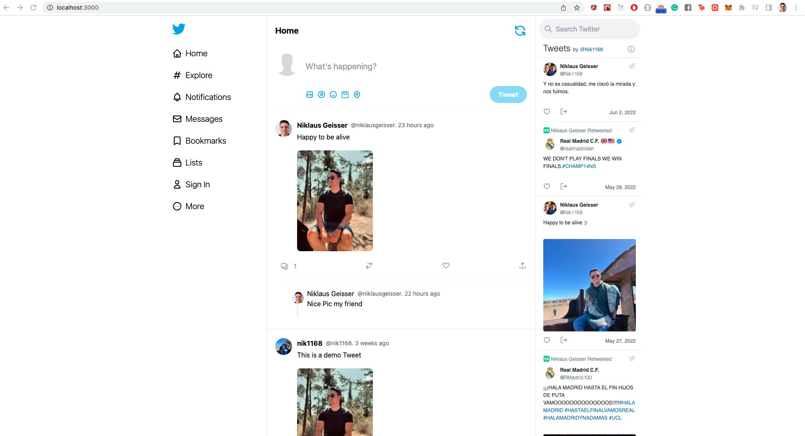

# Twitter Clone
This is a Twitter clone using Nextjs and Sanity with the following features:
- Google Sign-in
- Create Tweets and comments
- React toast notifications
- Display Twitter Widgets 

Special thanks to Sonny Sangha as this project was based on his twitter clone tutorial:
https://youtu.be/rCselwxbUgA

## Tech Stack
- Tailwind CSS
- Jest
- Sanity
- NextJS
- NextAuth

## Set-up

Create a `.env.local` file based on `.env.local.sample`

Install dependencies
```bash
yarn install
```
Start application

```bash
yarn dev
```

## Demo

https://drive.google.com/file/d/1CADTcVjETCT4Q0EurZGvLsfOvaINkP7q/view?usp=sharing

### Main Screen


